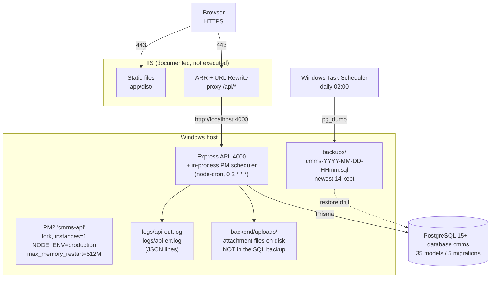

# System Architecture

Every claim in this document is traceable to a file in this repository. Where a documented intention is not implemented, that gap is stated rather than glossed over.

## Purpose & scope

This document describes how CommandPulse CMMS is assembled: its runtime components, how a request travels through the system, where trust boundaries sit, how the preventive-maintenance scheduler behaves, and how data is protected.

**In scope:** the application tier (React SPA, Express API, PostgreSQL), the process layer (PM2, node-cron scheduler), the documented IIS reverse proxy, the security model, and the backup strategy.

**Out of scope:** build and release procedure (`scripts\build.bat`), phase-by-phase project history (`CMMS_FINALIZATION_TRACKER.md`), step-by-step Windows/IIS installation (`INSTALLATION_GUIDE.md`), and endpoint-by-endpoint API reference (Swagger at `/api-docs`).

**Audience:** ops engineers deploying and running the system; future maintainers changing it; auditors establishing what controls actually exist versus what is merely planned.

## Components

### React 19 SPA (`app/`)

A Vite 7 + TypeScript single-page app. In development the Vite dev server listens on port 3000 and proxies `/api` to the backend, so the browser issues same-origin requests and no CORS preflight is needed locally (`app/vite.config.ts`). For production the app is type-checked and bundled to static assets under `app/dist/`, which the reverse proxy serves directly; the API only ever returns JSON. Client state uses Zustand, charts use Recharts, and the dashboard includes a React Three Fiber canvas for an animated KPI visualisation (`app/src/components/dashboard/TacticalDashboardGrid.tsx`). The SPA holds no secrets and no long-lived credentials — see [Security boundaries](#security-boundaries).

### Express + TypeScript API (`backend/`)

An ESM Node application (`"type": "module"` in `backend/package.json`) built with `tsc` to `backend/dist/` and run as plain Node. It listens on port 4000 (`process.env.PORT`, default `4000`). Data access goes through Prisma ORM against PostgreSQL. The API is stateless with respect to sessions: it validates a bearer JWT and holds no session store. It mounts 24 route groups plus a Swagger UI, and every router except `auth.ts` applies `router.use(authenticate)` so authentication is enforced per router rather than globally. Cross-cutting concerns are deliberately separated: `src/middleware/` (auth, RBAC, validation, audit), `src/services/` (domain logic and the scheduler), `src/utils/` (config, logger, CSV, sequencing).

### PostgreSQL 15+

The system of record, database name `cmms`. The schema is **migration-managed** — 35 Prisma models across 5 migrations, applied with `prisma migrate deploy`. `prisma db push` is retired and must not be used. Integrity relies on a mix of Prisma-level constraints and hand-written partial unique indexes, notably `WorkOrder(sourcePlanId, sourcePlanCycle) WHERE isDeleted = false`, which is what makes PM generation idempotent.

### PM2 process manager (`backend/ecosystem.config.cjs`)

Runs the API in **fork mode with `instances: 1`**. This is mandatory, not incidental: the PM scheduler runs in-process, so cluster mode would start one scheduler per worker and multiply work-order generation. The config also sets `max_memory_restart: 512M` and forces `NODE_ENV: 'production'`, which has a direct security consequence described under [K6_MODE](#k6_mode-production-guard). `merge_logs: true` keeps stdout and stderr in one stream for `pm2-logrotate`; `log_date_format` is deliberately omitted because plain-text prefixes would break JSON-lines parsing, since pino already stamps an ISO `time` on every record.

### IIS reverse proxy (documented only)

Described in `INSTALLATION_GUIDE.md` §"Enable HTTPS / TLS". IIS terminates TLS and forwards plaintext to `http://localhost:4000`; the API performs no TLS itself and holds no certificate. IIS serves `app/dist/` as static content and proxies only `/api/*` to the API via ARR plus URL Rewrite. **This deployment has not been executed end to end.** One consequence of that gap is recorded under [Security boundaries](#security-boundaries): the API never sets Express `trust proxy`.

### PM scheduler (node-cron, in-process)

A single in-process `node-cron` job (`backend/src/services/scheduler.ts`) that generates preventive-maintenance work orders. Its schedule comes from `PM_SCHEDULER_CRON`, defaulting to `0 2 * * *` (daily 02:00). Only `strategyType: 'Time'` plans are processed; `Meter` and `Combined` plans are counted and logged as deferred, because the meter strategy is not implemented. Full behaviour is in [PM scheduler data flow](#pm-scheduler-data-flow).

## Deployment topology



Two data stores fall **outside** the database and are not covered by the SQL backup: `backend/uploads/` and `backups/`. See [Backup strategy](#backup-strategy) for the risk this creates.

## Request lifecycle

Traced through `POST /api/work-orders` (`backend/src/routes/workOrders.ts`).

```
Browser
  │  fetch POST /api/work-orders
  │  Authorization: Bearer <jwt>
  ▼
Vite dev proxy (:3000 → :4000)          [dev only]
  or IIS ARR rewrite (:443 → :4000)     [documented production path]
  ▼
Express
  │
  ├─ helmet({ contentSecurityPolicy: false })      index.ts:60
  ├─ cors({ origin: allow-list })                  index.ts:61
  ├─ /api/auth/login rate limiter only             index.ts:50
  ▼
router.use(authenticate)                            workOrders.ts:17
  │  missing/malformed Bearer  → 401
  │  jwt.verify against JWT_SECRET → req.user = { userId, username, role }
  ▼
authorizeMinRole('Requester')                        workOrders.ts (route arg)
  │  roleHierarchy rank below 2 → 403
  ▼
validate(workOrderCreateSchema)                      validate() middleware
  │  Zod parse of req.body → 400 on failure
  ▼
handler
  ├─ generateWoNumber()            utils/sequence.ts   (SystemConfig prefix + SequenceCounter)
  ├─ prisma.$transaction(...)      →  BEGIN / WorkOrder INSERT / COMMIT
  ├─ logAudit(...)                  middleware/audit.ts
  └─ res.status(201).json(...)
  ▼
pino-http access log (status + responseTime)         index.ts
  ▼
Browser
```

Ordering is enforced by construction, not convention: `authenticate` is registered with `router.use()` before any route is declared, so it cannot be forgotten per-route, and `authorizeMinRole` independently rejects an absent `req.user` with 401 rather than trusting the caller. The same router-wide pattern holds in all 23 non-`auth` routers.

## Security boundaries

| Control | Implementation | Reference |
|---|---|---|
| JWT bearer tokens | HS256 via `jsonwebtoken`; `jwt.verify` per request | `middleware/auth.ts` |
| Secret fail-closed | `JWT_SECRET` missing ⇒ throw at boot, no default | `utils/config.ts` |
| Token lifetime | Fixed absolute expiry, default 28800 s (8 h) | `utils/config.ts` |
| Idle timeout | 30 min + 60 s warning, **client-side only** | `app/src/hooks/useIdleTimeout.ts` |
| RBAC | 6-rank hierarchy, `authorizeMinRole` | `middleware/auth.ts` |
| Exact-role guard | `authorize(...)` for Administrator-only routes | `middleware/auth.ts` |
| CORS | Comma-separated allow-list, default `http://localhost:3000` | `index.ts:40` |
| Security headers | `helmet()` with **CSP disabled** | `index.ts:60` |
| Login rate limit | 20 per 15 min per IP | `index.ts:48` |
| Proxy trust | `trust proxy = 1` (one hop) — see caveat below | `index.ts:60` |
| Account lockout | 5 failures in 15 min ⇒ 30 min lock + `Account_Lockout` alert | `routes/auth.ts` |
| Audit trail | `logAudit` on mutating handlers | `middleware/audit.ts` |

Role ranks ascend: `View-Only` 1, `Requester` 2, `Technician` 3, `Maintenance Supervisor` 4, `Maintenance Planner` 5, `Administrator` 6.

### K6_MODE production guard

Load tests sign in once per virtual user from a single source IP, which the 20-per-15-minute limit rejects. The override exists but is deliberately hard to trigger:

```ts
const isK6Mode = process.env.K6_MODE === '1' && process.env.NODE_ENV !== 'production';
const LOGIN_LIMIT = isK6Mode ? 200 : 20;
```

Both conditions are required. Since PM2 pins `NODE_ENV: 'production'`, **any process started by the documented production start path ignores `K6_MODE` entirely** — the override is reachable only in a development-mode process. This is intentional: the raised ceiling weakens the brute-force protection that account lockout depends on, so it must not be reachable in production. Verified behaviour across the configuration matrix:

| `K6_MODE` | `NODE_ENV` | Effective limit |
|---|---|---|
| `1` | `production` | 20 (override inert) |
| `1` | `development` | 200 |
| unset | `production` | 20 |
| unset | `development` | 20 |

### Controls that are absent

Stating these plainly matters more than the table above:

- **The idle timeout is client-side only.** A 30-minute idle timeout with a 60-second warning does exist and is wired into `AppLayout` (`app/src/hooks/useIdleTimeout.ts`, 3 passing tests), keyed on `mousemove`, `mousedown`, `keydown`, `scroll`, and `touchstart` plus API activity. On expiry it calls the client-side `logout()` store action and redirects to `/login`. **It invalidates nothing server-side.** There is no logout endpoint and no token revocation, so the JWT stays cryptographically valid for its full 8 hours; a client that discards its token does not stop anyone else from replaying a captured one. Treat this as a convenience logout, not a session control.
- **No refresh tokens and no logout endpoint.** `auth.ts` exposes only `POST /login` and `GET /me`. A `RefreshToken` model exists in the schema and is unused. Because auth is stateless, a logout cannot invalidate an already-issued token; the 30-minute account lockout and the 8-hour expiry are the only server-side brakes.
- **Proxy trust is one hop, so direct access must be impossible.** `app.set('trust proxy', 1)` makes the API trust one hop of `X-Forwarded-For`, which is what lets `req.ip` and `express-rate-limit` see the real client behind IIS. The measured consequence: with the limiter active, direct requests carrying no header were capped at 20 then 429, while the same 24 requests each supplying a distinct `X-Forwarded-For` were **all accepted**. Three deployment controls close that route, and all three are required:
  1. **`BIND_HOST=127.0.0.1`** in `backend\.env` behind IIS. The default is `0.0.0.0` so a fresh dev checkout works without extra steps; it is a development convenience, not a production value.
  2. **A Windows Firewall rule blocking inbound TCP 4000 from any non-loopback address.** Defense-in-depth that holds even if `BIND_HOST` is later mis-set or IIS is removed.
  3. **ARR must overwrite, not append to, `X-Forwarded-For`.** An appending proxy lets a client prepend a forged value that the single trusted hop still resolves to the attacker.

  The API logs its bind address on startup (`bound to 127.0.0.1`), so a misconfiguration is visible in the first log lines rather than inferred later. Exact commands are in `INSTALLATION_GUIDE.md` §Step 7.
- **Content-Security-Policy is off** while `helmet()` is otherwise enabled.

## PM scheduler data flow

`runSchedulerOnce()` in `backend/src/services/scheduler.ts`, plus `startScheduler()` which wraps it in `cron.schedule(PM_SCHEDULER_CRON ?? '0 2 * * *')`.

```
acquireStartupLock()                       startup, before any scheduling
  │  SchedulerRun row carrying pid@hostname + heartbeatAt
  │  LOCK_FRESH_MS = 5 min
  ├─ foreign lock with heartbeatAt > now-5min → REFUSE to start, log, exit
  └─ otherwise create own row, remember schedulerRunId
  ▼
count plans where strategyType IN ('Meter','Combined')   → log deferral count
  ▼
load plans where isDeleted=false, activeFlag=true, strategyType='Time'
  │  include equipment.functionalLocationId + taskList.operations
  ▼
heartbeatLock()                            refresh heartbeatAt mid-run
  ▼
for each batch of BATCH_SIZE = 50, yielding via setImmediate between batches:
  │
  ├─ if plan.startDate > today → skip
  ├─ gapDays  = whole UTC days since start
  ├─ stepDays = intervalDays(intervalValue, intervalUnit)
  ├─ n        = floor(gapDays / stepDays)
  ├─ cycleKey = isoDay(start + n*stepDays)      ← the idempotency key
  ├─ if cycleKey > today → skip
  ├─ resolve functionalLocationId (plan, else via plan.equipment)
  ├─ woNumber = generateWoNumber()
  └─ prisma.$transaction:
        WorkOrder.create  { type:'PM', status:'Draft', priority:'Medium',
                            sourcePlanId, sourcePlanCycle: cycleKey,
                            createdBy:'scheduler' }
        + WorkOrderOperation.create per taskList operation
        │
        └─ on P2002 → wosSkipped += 1, logged as "skipped (idempotent)"
           on any other error → recorded in result.errors, run continues
  ▼
completeRunRecord(result, errors ? 'error' : 'success')
  ▼
log summary: plansEvaluated / wosCreated / wosSkipped / errors
```

**Idempotency** is enforced by the database, not by application logic. The partial unique index on `(sourcePlanId, sourcePlanCycle) WHERE isDeleted = false` makes a second insert for the same plan-day impossible; the resulting `P2002` is caught and counted as a skip, so a retried or overlapping run creates nothing extra.

**The startup lock** lives in `acquireStartupLock()` and is backed by the `SchedulerRun` table, not by memory — a process restart on a different host is still excluded. It is a lease: a lock whose heartbeat is older than 5 minutes is considered stale and may be taken over, so a hard crash cannot wedge the scheduler permanently. `GET /api/health/scheduler` reports the stalest-run state and raises a `SystemAlert` when the last successful run is too old.

The safeguards, in the order they engage: startup lease lock, mid-run heartbeat, database-level cycle idempotency, bounded batches with an event-loop yield, per-plan error isolation, explicit accounting for deferred meter plans, and a persisted run record with success/error status.

## Backup strategy

Implemented in `scripts/backup.bat` and rehearsed by `scripts/restore-drill.bat`; evidence is recorded in tracker row 6.2.

- **Schedule:** daily 02:00 via Windows Task Scheduler, invoking `pg_dump.exe` (resolved from `PATH` first, then a documented PostgreSQL 18 local fallback).
- **Output:** plain SQL, `backups\cmms-YYYY-MM-DD-HHmm.sql`, written to a `.tmp` file first and only promoted after the dump exits 0 and is non-empty, so a failed run can never leave a truncated file that looks valid.
- **Flags:** `--no-owner --no-privileges`, restoring as a single owner.
- **Retention:** newest 14 files kept, older ones deleted — roughly 14 days at one run per day.
- **RPO:** ≤ 24 h, bounded by the daily schedule.
- **RTO:** 5.35 s measured in the initial drill, on a ~307 KB dump containing 84 work orders. Read that as a smoke-level restore time for a small dataset, not a production RTO commitment for a full-size database.
- **Restore drill:** `restore-drill.bat` restores a dump into `cmms_restore_test`, runs a real `WorkOrder` query against it, drops the database, and asserts it is gone. This is what turns "we have backups" into evidence.

### Gap: uploaded files are not backed up

`backup.bat` dumps **only** the database. Attachments are real files written to `backend/uploads/` by multer (`routes/attachments.ts`); the `Attachment` row stores only `storagePath`, a relative path. A `pg_dump` therefore preserves the *pointer* and none of the *bytes*.

No script under `scripts/` references `uploads` at all. Restoring the database onto a fresh host yields attachments that 404 on download. `backend/uploads/` is also gitignored, so there is no second copy. Until a file-level backup is added, treat attachment durability as **unprotected** and do not promise it in any SOW or client-facing commitment.

## Environment & configuration

Names and purposes only. No values are reproduced here, and no `.env` file was read to produce this document.

| Variable | Read by | Purpose | Default |
|---|---|---|---|
| `DATABASE_URL` | Prisma (`schema.prisma`) | PostgreSQL connection string for database `cmms` | none — required |
| `JWT_SECRET` | `utils/config.ts` | HS256 signing secret. Absent ⇒ boot fails | none — required |
| `JWT_EXPIRES_IN` | `utils/config.ts` | Token lifetime in **seconds** | `28800` (8 h) |
| `PORT` | `index.ts` | API listen port | `4000` |
| `LOG_LEVEL` | `utils/logger.ts` | pino level; validated against the 7 pino levels | `info` |
| `CORS_ORIGINS` | `index.ts` | Comma-separated browser origin allow-list | `http://localhost:3000` |
| `K6_MODE` | `index.ts` | `1` raises the login limit to 200 — **only** when `NODE_ENV !== 'production'` | unset (limit 20) |
| `NODE_ENV` | `index.ts`, PM2 | `production` disables the K6 override; PM2 always sets it | unset |
| `PM_SCHEDULER_CRON` | `services/scheduler.ts` | node-cron expression for PM generation | `0 2 * * *` |
| `SEED_DEMO` | `prisma/seed.ts` only | `1` permits the destructive demo wipe. Never read by the API | unset (seed exits 0) |

Two gaps in this table's own coverage:

- `PM_SCHEDULER_CRON` is now present in `backend/.env.example`. Note that the unquoted value `0 2 * * *` is parsed correctly by Node's `--env-file`, but any tooling that treats spaces as value separators will mangle it; quote it if you introduce such a tool.
- `SEED_DEMO` is not an API variable. `seed.ts` refuses to run without it and a non-production `NODE_ENV`, and exits 0 with a skip message otherwise. The supported entry point is `scripts\seed-demo.bat`.

`backend/.env` is loaded by Node's own `--env-file` flag at launch; no `dotenv` dependency is present. Consequently the API reads no configuration file itself — omitting `--env-file` means the process starts with defaults and, for `JWT_SECRET`, fails fast rather than running insecurely.

The batch scripts use a separate set of PostgreSQL client variables — `PGHOST`, `PGPORT`, `PGDATABASE`, `PGUSER`, and `PGPASSWORD`, which must be supplied by the scheduled-task environment.

## Known limitations & deferrals

- **P2028 connection-pool exhaustion under concurrency.** In the 6.5 k6 run — 50 VUs, 2 min ramp / 5 min steady / 1 min ramp-down, 18,540 iterations and 37,265 requests at 77.6 req/s — **both configured thresholds passed** (`p(95)` 36.19 ms against a 2000 ms budget; `http_req_failed` 0.04%, 15/37,265). Separately, **15 of 140 logins returned HTTP 500** from `PrismaClientKnownRequestError` P2028, "Unable to start a transaction in the given time", i.e. connection-pool exhaustion when many logins start a transaction at once. The read path was unaffected, which is why the failure rate stayed inside budget and the issue would be missed by threshold-only monitoring. Needs Prisma pool sizing plus PostgreSQL `max_connections` tuning. Recorded as a **post-go-live blocker for the SOW §4.1 200-user load test; not a v1.0.0 blocker**.
- **200-user load test deferred.** The SOW §4.1 200-VU test is not performed and cannot be signed off until the pool issue above is resolved. The k6 smoke test that found it is `scripts/k6/smoke.js`.
- **2.10 Zod validation gaps — still open.** The `validate()` middleware validates `req.body` only; path parameters are not validated. A pre-flight audit counted **45 gaps**, covering parameterized `PUT`/`DELETE` mutations across functional locations, equipment, meters, work centers, materials, failure codes, task lists, notifications, work orders and their child collections, labour, external services, maintenance plans, safety checklists, alerts, comments, attachments, and users. Additionally `workOrderUpdateSchema` and `operationUpdateSchema` omit fields their handlers accept. Unvalidated identifiers reach Prisma directly.
- **ESLint baselines are not clean.** Backend reports 49 errors, frontend 32 errors and 2 warnings. Types and tests pass; the debt is tracked and unfixed. Do not read a green type-check as a clean lint.
- **IIS HTTPS documented but not executed.** The reverse-proxy path, including the ARR rewrite and the TLS binding, has never been run end to end. Treat it as untested, and resolve the `trust proxy` omission before relying on it.
- **Uploaded files have no backup.** See [Gap: uploaded files are not backed up](#gap-uploaded-files-are-not-backed-up).
- **Meter and Combined PM strategies are unimplemented.** Such plans are stored, counted, and logged as deferred on every run, but never generate work orders.
- **In-memory rate limiting.** The login limiter uses the default in-process store, so limits reset on restart and are not shared across instances. This is acceptable only because PM2 is pinned to one instance.

## Cross-references

- `INSTALLATION_GUIDE.md` — Windows/IIS deployment, PM2, backup, restore drill, and k6 procedures.
- `CMMS_FINALIZATION_TRACKER.md` — per-phase status, verification evidence, and deferred items.
- `README.md` — user-facing feature summary and known issues.
- `http://localhost:4000/api-docs` — live OpenAPI schema.
- `GET /api/health/scheduler` — scheduler lease and last-success state.
