# ER Diagram — CMMS v1.0.0

**Source of truth:** [`backend/prisma/schema.prisma`](../backend/prisma/schema.prisma)
**Database:** PostgreSQL. Datasource `db`, Prisma client generator `prisma-client-js`.
**Scope:** all 35 models, verified against the schema on 2026-09-25.

## How to read this

- **Entity names are the physical table names.** The schema declares no `@@map`, so the
  Prisma model name and the PostgreSQL table name are identical.
- Cardinality follows Mermaid `erDiagram` notation:
  - `||` exactly one, `o|` zero or one, `|{` one or more, `o{` zero or more.
  - The symbol before `--` describes the parent side, after `--` the child side.
- Attributes shown are **curated**: primary keys, unique business codes, foreign keys and
  the fields that carry the domain meaning. They are not the complete field list — see
  [`DATA_DICTIONARY.md`](./DATA_DICTIONARY.md) for every field, type, default and soft-delete flag.
- Diagram-only details that are easy to misread as relationships but are **not** foreign
  keys are called out in [Notes and caveats](#notes-and-caveats).

## Diagram

```mermaid
erDiagram
    %% ============================================================
    %% Identity and access
    %% ============================================================
    USER {
        string userId PK
        string username UK
        string role
        boolean isActive
        int failedLoginCount
        datetime lockedUntil
        string workCenterId FK
    }

    REFRESH_TOKEN {
        string tokenId PK
        string token UK
        string userId FK
        datetime expiresAt
        boolean revoked
    }

    %% ============================================================
    %% Location and assets
    %% ============================================================
    FUNCTIONAL_LOCATION {
        string functionalLocationId PK
        string locationCode UK
        string locationType
        string operationalStatus
        boolean safetyCritical
        string parentLocationId FK
    }

    EQUIPMENT {
        string equipmentId PK
        string equipmentCode UK
        string name
        string criticality
        string operationalStatus
        json technicalParameters
        string functionalLocationId FK
    }

    EQUIPMENT_METER {
        string meterId PK
        string equipmentId FK
        string meterName
        string unitOfMeasure
        float lastReading
        datetime lastReadingDate
    }

    METER_READING {
        string readingId PK
        string meterId FK
        float readingValue
        datetime readingDate
    }

    %% ============================================================
    %% Organisation and master data
    %% ============================================================
    WORK_CENTER {
        string workCenterId PK
        string code UK
        string name
        float dailyCapacityHours
        float costRatePerHour
        boolean isActive
    }

    CRAFT {
        string craftId PK
        string craftCode
        string workCenterId FK
        float hourlyRate
    }

    MATERIAL {
        string materialId PK
        string materialCode UK
        string unitOfMeasure
        float standardCost
        float currentStock
    }

    EQUIPMENT_BOM_MATERIAL {
        string bomId PK
        string equipmentId FK
        string materialId FK
        float quantity
    }

    FAILURE_CODE {
        string failureCodeId PK
        string code
        string parentCodeId FK
        string description
    }

    CAUSE_CODE {
        string causeCodeId PK
        string code
        string description
    }

    TASK_LIST {
        string taskListId PK
        string code UK
        string equipmentClass
        string equipmentId FK
        string workCenterId FK
    }

    TASK_LIST_OPERATION {
        string taskOperationId PK
        string taskListId FK
        string craftId FK
        int sequenceNumber
        float plannedHours
        int numberOfTechnicians
    }

    %% ============================================================
    %% Work management
    %% ============================================================
    NOTIFICATION {
        string notificationId PK
        string notificationNumber UK
        string type
        string priority
        string status
        boolean breakdownFlag
        string functionalLocationId FK
        string equipmentId FK
        string reportedByUserId FK
    }

    WORK_ORDER {
        string workOrderId PK
        string woNumber UK
        string type
        string priority
        string status
        boolean breakdownFlag
        boolean safetyCriticalFlag
        datetime plannedStart
        datetime plannedFinish
        string sourcePlanId
        string sourcePlanCycle
        string functionalLocationId FK
        string equipmentId FK
        string workCenterId FK
        string supervisorUserId FK
    }

    WORK_ORDER_NOTIF_LINK {
        string workOrderId PK,FK
        string notificationId PK,FK
    }

    WORK_ORDER_OPERATION {
        string operationId PK
        string workOrderId FK
        string craftId FK
        int sequenceNumber
        float plannedHours
        float actualHours
        string status
    }

    WORK_ORDER_MATERIAL {
        string woMaterialId PK
        string workOrderId FK
        string materialId FK
        float plannedQuantity
        float actualQuantity
        float reservationQuantity
        float unitCost
    }

    LABOR_ENTRY {
        string laborEntryId PK
        string operationId FK
        string userId FK
        float hoursWorked
        datetime entryDateTime
    }

    EXTERNAL_SERVICE_COST {
        string serviceCostId PK
        string workOrderId FK
        string vendor
        string description
        float cost
        string invoiceRef
    }

    COST_SPLIT {
        string splitId PK
        string workOrderId FK
        string costCenterCode
        float percentage
    }

    %% ============================================================
    %% Safety
    %% ============================================================
    SAFETY_CHECKLIST_TEMPLATE {
        string checklistTemplateId PK
        string name
        boolean isMandatory
    }

    CHECKLIST_ITEM {
        string itemId PK
        string checklistTemplateId FK
        int sequenceNumber
        string description
    }

    WORK_ORDER_CHECKLIST {
        string woChecklistId PK
        string workOrderId FK
        string checklistTemplateId FK
        string status
        string signedBy FK
        datetime signedDate
    }

    WORK_ORDER_CHECKLIST_ITEM {
        string woChecklistItemId PK
        string woChecklistId FK
        string itemId FK
        string response
        string comment
    }

    %% ============================================================
    %% Preventive maintenance
    %% ============================================================
    MAINTENANCE_PLAN {
        string planId PK
        string planCode
        string strategyType
        int intervalValue
        string intervalUnit
        int callHorizonValue
        string callHorizonUnit
        datetime startDate
        datetime endDate
        boolean activeFlag
        string functionalLocationId
        string equipmentId FK
        string workCenterId FK
        string taskListId FK
    }

    MAINTENANCE_PLAN_METER {
        string planMeterId PK
        string planId FK
        string meterId FK
        float meterInterval
    }

    %% ============================================================
    %% System and supporting tables
    %% ============================================================
    AUDIT_LOG_ENTRY {
        string auditId PK
        string tableName
        string recordId
        string action
        string fieldName
        string oldValue
        string newValue
        string ipAddress
        datetime timestamp
        string userId FK
    }

    SYSTEM_ALERT {
        string alertId PK
        string alertType
        string title
        string message
        boolean isRead
        string relatedEntityType
        string relatedEntityId
        string userId FK
    }

    COMMENT {
        string commentId PK
        string entityType
        string entityId
        string content
        string userId FK
    }

    ATTACHMENT {
        string attachmentId PK
        string entityType
        string entityId
        string originalName
        string mimeType
        int sizeBytes
        string storagePath
        string uploadedByUserId
    }

    SYSTEM_CONFIG {
        string configId PK
        string key UK
        string value
    }

    SCHEDULER_RUN {
        string schedulerRunId PK
        string hostname
        int pid
        string status
        datetime startedAt
        datetime heartbeatAt
        datetime completedAt
        int plansEvaluated
        int wosCreated
        int wosSkipped
        string errorMessage
    }

    SEQUENCE_COUNTER {
        string code PK
        int value
    }

    %% ============================================================
    %% Relationships
    %% ============================================================

    %% Identity and access
    USER ||--o{ REFRESH_TOKEN : "owns"
    WORK_CENTER o|--o{ USER : "assigned to"

    %% Location hierarchy and equipment
    FUNCTIONAL_LOCATION o|--o{ FUNCTIONAL_LOCATION : "parent of"
    FUNCTIONAL_LOCATION ||--o{ EQUIPMENT : "contains"
    FUNCTIONAL_LOCATION ||--o{ NOTIFICATION : "raised at"
    FUNCTIONAL_LOCATION ||--o{ WORK_ORDER : "performed at"

    %% Equipment roll-ups
    EQUIPMENT ||--o{ EQUIPMENT_METER : "measured by"
    EQUIPMENT_METER ||--o{ METER_READING : "records"
    EQUIPMENT ||--o{ EQUIPMENT_BOM_MATERIAL : "billed to parts"
    MATERIAL ||--o{ EQUIPMENT_BOM_MATERIAL : "appears in"
    EQUIPMENT o|--o{ TASK_LIST : "task list for"
    EQUIPMENT o|--o{ NOTIFICATION : "concerns"
    EQUIPMENT o|--o{ WORK_ORDER : "asset worked on"
    EQUIPMENT o|--o{ MAINTENANCE_PLAN : "has plan"

    %% Organisation and master data
    WORK_CENTER ||--o{ CRAFT : "offers"
    WORK_CENTER ||--o{ WORK_ORDER : "scheduled in"
    WORK_CENTER ||--o{ TASK_LIST : "prepared by"
    WORK_CENTER ||--o{ MAINTENANCE_PLAN : "executes"
    TASK_LIST ||--o{ MAINTENANCE_PLAN : "drives"
    CRAFT ||--o{ TASK_LIST_OPERATION : "requires"
    CRAFT ||--o{ WORK_ORDER_OPERATION : "requires"
    TASK_LIST ||--o{ TASK_LIST_OPERATION : "comprises"
    FAILURE_CODE o|--o{ FAILURE_CODE : "parent of"
    MATERIAL ||--o{ WORK_ORDER_MATERIAL : "consumed on"

    %% Work management
    USER ||--o{ WORK_ORDER : "supervises"
    USER ||--o{ NOTIFICATION : "reports"
    USER ||--o{ LABOR_ENTRY : "books"
    USER ||--o{ WORK_ORDER_CHECKLIST : "signs"
    USER ||--o{ AUDIT_LOG_ENTRY : "audited by"
    USER ||--o{ SYSTEM_ALERT : "notified"
    USER ||--o{ COMMENT : "writes"
    WORK_ORDER ||--o{ WORK_ORDER_OPERATION : "comprises"
    WORK_ORDER ||--o{ WORK_ORDER_MATERIAL : "consumes"
    WORK_ORDER ||--o{ EXTERNAL_SERVICE_COST : "purchased through"
    WORK_ORDER ||--o{ COST_SPLIT : "charged to"
    WORK_ORDER ||--o{ WORK_ORDER_CHECKLIST : "gates"
    WORK_ORDER ||--o{ WORK_ORDER_NOTIF_LINK : "raised from"
    NOTIFICATION ||--o{ WORK_ORDER_NOTIF_LINK : "converted to"
    WORK_ORDER_OPERATION ||--o{ LABOR_ENTRY : "charged by"

    %% Safety
    SAFETY_CHECKLIST_TEMPLATE ||--o{ CHECKLIST_ITEM : "defines"
    SAFETY_CHECKLIST_TEMPLATE ||--o{ WORK_ORDER_CHECKLIST : "instantiated as"
    WORK_ORDER_CHECKLIST ||--o{ WORK_ORDER_CHECKLIST_ITEM : "answered by"
    CHECKLIST_ITEM ||--o{ WORK_ORDER_CHECKLIST_ITEM : "answered as"

    %% Preventive maintenance
    MAINTENANCE_PLAN ||--o{ MAINTENANCE_PLAN_METER : "meter trigger"
    EQUIPMENT_METER ||--o{ MAINTENANCE_PLAN_METER : "triggers"
```



## Notes and caveats

These are properties of the current schema, recorded so the diagram is not read as
promising more than the schema delivers.

1. **`CAUSE_CODE` has no foreign key at all.** Neither `CAUSE_CODE` nor `FAILURE_CODE` is
   referenced by `WORK_ORDER` or `NOTIFICATION`. Both hierarchies exist as reference data,
   but no column currently records a failure or cause against a work order. This is a
   functional gap, not a modelling convenience — see
   [DATA_DICTIONARY.md](./DATA_DICTIONARY.md#org--master-data) for the exact field state.

2. **`MAINTENANCE_PLAN.functionalLocationId` is not a foreign key.** The column exists
   (nullable) and is listed above without a `FK` marker, because the schema declares no
   `@relation` for it. It is currently an unenforced reference.

3. **`Attachment` and `Comment` are polymorphic, not relational to their target.**
   `entityType` + `entityId` pair with the target table at the application layer. There is
   no database foreign key, so the database cannot guarantee the target row exists.
   `Attachment.uploadedByUserId` is likewise a plain string with no `USER` relation.

4. **Five tables stand alone** and intentionally have no foreign key: `CAUSE_CODE`
   (self-reference aside, see 1), `ATTACHMENT`, `SYSTEM_CONFIG`, `SCHEDULER_RUN` and
   `SEQUENCE_COUNTER`. The last three are infrastructure for the application, not for the
   maintenance domain.

5. **Optional parents are drawn as `o|`.** `WORK_ORDER.equipmentId`,
   `NOTIFICATION.equipmentId`, `TASK_LIST.equipmentId`, `MAINTENANCE_PLAN.equipmentId` and
   `USER.workCenterId` are all nullable, so a child may exist without the parent row.
   `WORK_ORDER.functionalLocationId` and `WORK_ORDER.workCenterId` are **required**.

6. **Soft delete is not uniform.** 18 of the 35 tables carry `isDeleted` and are soft
   deleted; the remaining 17 are hard deleted. In particular every work-order child
   collection (`WORK_ORDER_OPERATION`, `WORK_ORDER_MATERIAL`, `EXTERNAL_SERVICE_COST`,
   `COST_SPLIT`, `WORK_ORDER_CHECKLIST`, `WORK_ORDER_CHECKLIST_ITEM`) is hard deleted,
   while `WORK_ORDER` itself is soft deleted. Per-table detail is in the data dictionary.

7. **Business codes are unique only among live rows.** Uniqueness of `username`,
   `locationCode`, `equipmentCode`, `WorkCenter.code`, `materialCode`, `TaskList.code`,
   `notificationNumber`, `woNumber` and `planCode` is enforced by *partial* unique indexes
   created in migrations (`WHERE "isDeleted" = false`), not by Prisma `@unique`. A soft
   deleted row's code can therefore be reused. The same applies to the partial index on
   `WorkOrder(sourcePlanId, sourcePlanCycle)` that provides PM generation idempotency.

## Verifying this diagram

The entity list is derived from the schema, not maintained by hand. To re-check after a
schema change:

```powershell
# count models
(Select-String -Path backend\prisma\schema.prisma -Pattern '^model ').Count

# list table names (identical to model names: no @@map in this schema)
Select-String -Path backend\prisma\schema.prisma -Pattern '^model (\w+)' |
  ForEach-Object { $_.Matches[0].Groups[1].Value }
```

Both must report 35. Note that Mermaid cannot be validated by `tsc`; if a renderer is
available, render the block once after a schema change to confirm it parses.
